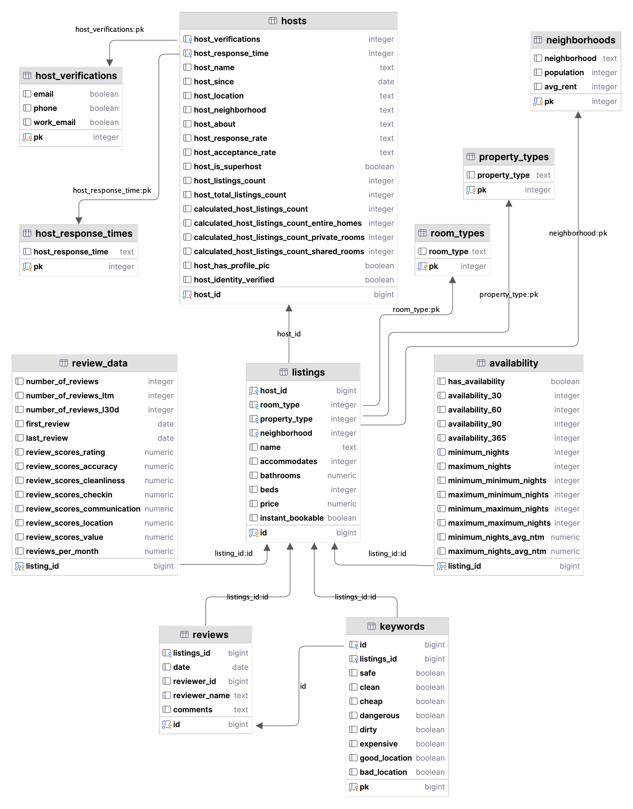

# Airbnb Data Analysis

This PostgreSQL pipeline cleans, validates, and normalizes Mexico City Airbnb listings and reviews data in order to analyze market trends.

The original data used in this project came from quarterly data published December 2023. The CSVs in this repo contain only the first 100 rows of the actual data that was used. Data source: [Inside Airbnb](http://insideairbnb.com/).

## Entity Relationship Diagram



## Instructions
1. Clone repo and install dependencies
```bash
   python3 -m venv venv
   source venv/bin/activate
   pip install -r requirements.txt
```

2. Create and configure your .env file
```bash
   cp .env.example .env
```

2. Start up Postgres
```bash
    brew services start postgresql
```

3. Run pipeline
```bash
    python etl/run.py
```
